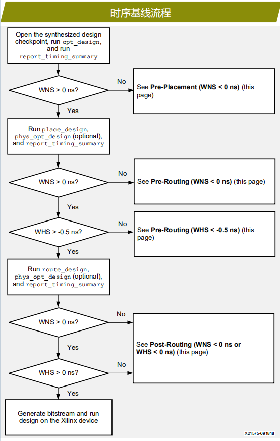
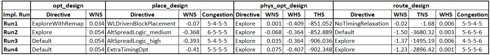

# 2时序基线流程

时序基线检查的目的是通过在每个实现步骤后分析和解决时序问题，确保设计满足时序要求。在编译流程中尽早纠正设计问题和约束问题，能带来更广泛的影响并实现更高的性能。

该流程要求在实现（Implementation）过程中的每一个子步骤结束之后都要**检查WNS是否大于0**，只有当WNS大于0时，才可以进行下一个子步骤。同时，在布局之后，还要检查WHS是否大于-0.5 ns。此外，只有当WNS小于0时，执行phys_opt_design才有意义，毕竟phys_opt_design的目的是修复建立时间违例。由此可见，在实现的前期，更多关注的是建立时间违例。

## 出错情况

### **预布局** **(WNS < 0 ns)**

**在 place_design 之前，时序报告反映的是假定每条逻辑路径的逻辑布局尽可能最优情况下的设计性能。**必须通过采用“初始检查”建议来解决建立时间违规。

### **预布线** **(WNS < 0 ns)**

**在 route_design 之前，时序报告反映的是假定每个单独网络存在最理想布线延迟，存在一些扇出损失且不考虑保持时间修复的影响（网络布线绕行）或拥塞时的设计性能。**

建立时间违规往往是下列原因导致的欠佳布局造成的：

(1) 高器件或 SLR 资源利用率；

(2) 因复杂逻辑连接造成的布局拥塞；

(3) 大量时序路径有过高的逻辑级数； 

(4) 不平衡时钟间的高时钟偏差或高时钟不确定性。

在 Explore 模式或 Aggressive Explore 模式下运行 `phys_opt_design`（-directive设置为Explore或Aggressive Explore），试图提升 post_place_design QoR。如果不成功，先重点提升布局 QoR。

### **预布线** **(WHS < -0.5 ns)**

如果布线后未达成性能目标且布线前最差负时序裕量 (WNS) 为正值，尽量减少估算的最差保持时序裕量 (WHS) 重大违规。减少并减轻预布线保持时间违规有助于route_design **重点关注 Fmax** **而非修复保持时间违规**。

### **布线后** **(WNS < 0 ns** **或** **WHS < 0 ns)**

在 route_design 后，首先通过审核日志文件或在布线后设计检查点 (DCP) 上运行 `report_route_status`，验证设计是否完全布线。

**布线违规和重大建立时间(WNS) 或保持时间 (WHS) 违规是由高拥塞导致的结果。**使用**分析建立时间违规**（第 3 页）、**解决保持时间违规**（第 4 页）以及**拥塞减少方法**（第 6 页），识别和实现解决步骤。

在 route_design 后尝试运行 `phys_opt_design`，解决 > -0.200 ns 的轻微建立时间违规。

在迭代设计、约束和编译策略时，保持在每个步骤后追踪 QoR，包括拥塞信息。使用 QoR 表比较运行特性，并确定在解决剩余的时序违规时的优先关注对象。

**提示**：在 place_design 和 route_design 后使用 report_qor_suggestions，自动识别帮助新编译提升 QoR 的设计、约束和工具选项更改。

基线流程的一个重要方面是设计分析。这里列出常用的用于设计分析的Tcl命令：

- report_timing_summary
- report_design_analysis
- report_methodology
- report_failfast

