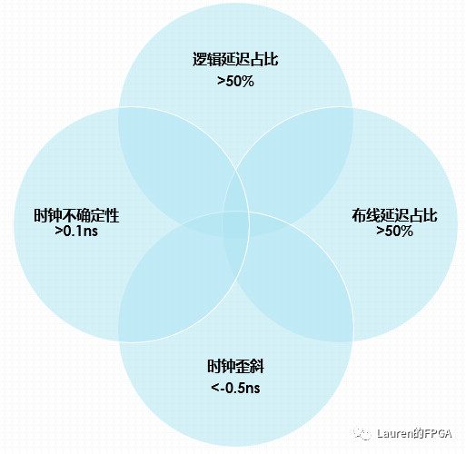
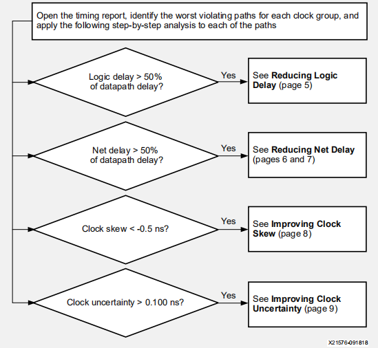
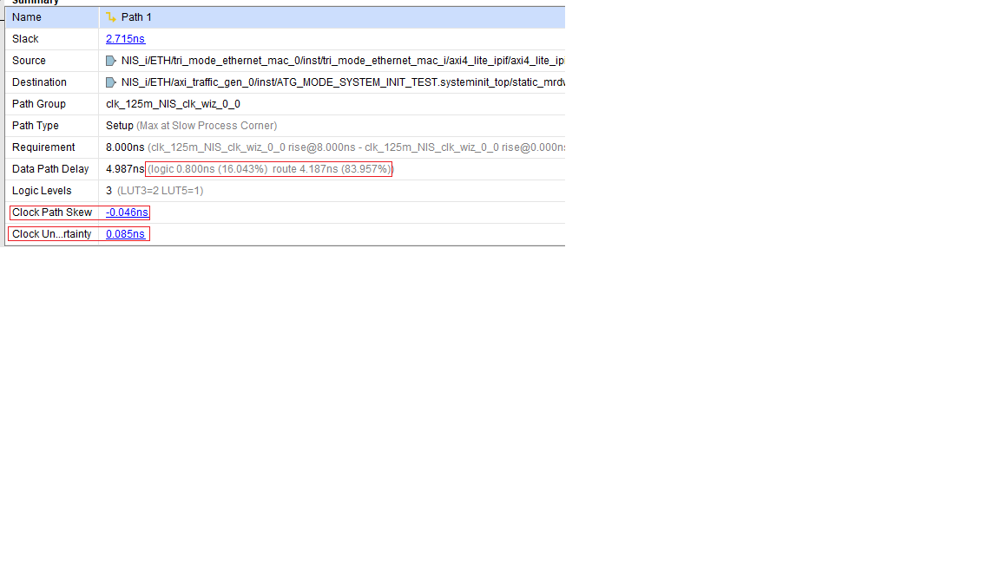

# 3分析建立时间违规流程

Setup slack与逻辑延迟、布线延迟、时钟歪斜和时钟不确定性有关。因此，首先要明确这几个因素中哪个因素对建立时间违例起关键作用。具体的衡量标准可由如下几个数值确定。这也是**UG1292**第三页的主题。

设计性能由如下因素决定：

-  **时钟偏差与时钟不确定性**：时钟如何高效实现

-  **逻辑延迟**：时钟周期内遍历的逻辑量
-  **网络或布线延迟：**Vivado 如何高效实现设计的布局和布线

当逻辑延迟占比超过50%时，要着重降低逻辑延迟；当布线延迟占比超过50%时，要把焦点放在布线延迟上；同时，也要关注一下时钟歪斜和时钟不确定性。当时钟歪斜小于-0.5 ns或时钟不确定性大于0.1 ns时，两者将成为时钟违例的主要“贡献者”。

在timing report（通过report_timing_summary生成）还是design analysis report（通过report_design_analysis生成）都可以看到上述具体数值：

