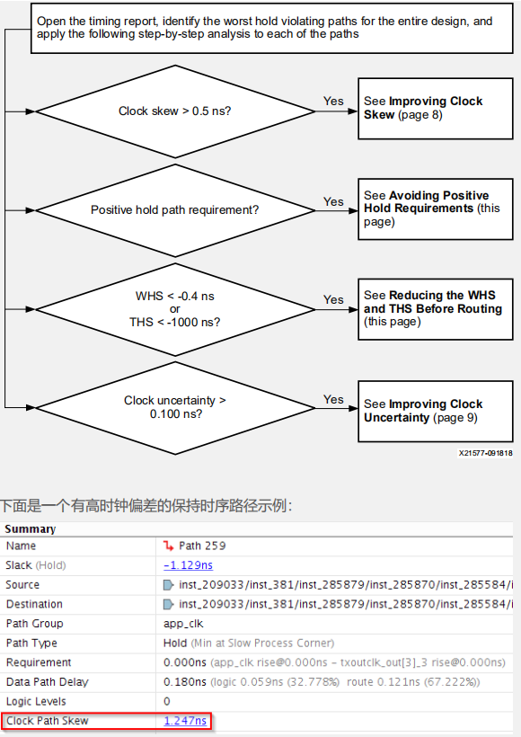
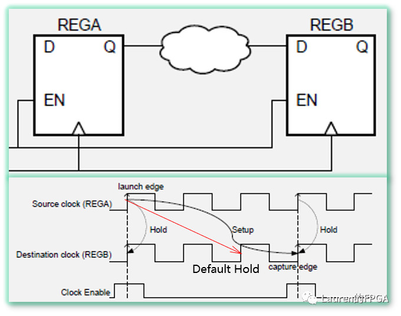

# 4解决保持时间违规流程

在分析place_design生成的dcp时，就要开始关注保持时间违例，尤其是当WHS < -0.5 ns时。这是因为过大的保持时间违例往往会导致布线时间增大，同时，在布线阶段，工具未必能修复此类违例。

解决保持时间违例流程如下图所示。按照此流程，要逐步关注以下几个因素：

- Clock Skew是否大于0.5 ns
- Hold Requirement是否为正（应该为0）
- WHS是否小于-0.4 ns或THS是否小于-1000 ns
- Clock Uncertainty是否大于0.1 ns



## **避免上升沿保持时间要求**

Hold Requirement为正的可能情形出现在使用多周期路径约束的时序路径中。如下图所示，时钟使能信号EN使得路径的Setup Requirement为3个时钟周期（为保证REG A发出数据在REG B不错过，在下一个EN时REG A到REG B的路径setup应该满足3时钟周期要求），但Hold Requirement仍应为0。



在此情况下，应采用如下图所示的多周期路径约束。**其中的第2条约束是对hold的调整，却往往容易被遗漏。对于-hold，它表示相对于缺省捕获沿（图中的Default hold，默认为setup往回1个时钟）,实际捕获沿应回调的时钟周期个数。**

```tcl
set_multicycle_path -from [get_pins REGA/C] -to [get_pins REGB/D] -setup 3
set_multicycle_path -from [get_pins REGA/C] -to [get_pins REGB/D] -hold 2
```

在使用多周期路径约束放松建立时间检查时，必须：

- 调整同一路径上的保持时间检查，让保持时间分析使用相同的启动沿和捕获沿。（第2条中调节default hold到launch edge的过程）
- 指定端点引脚，而不仅仅是单元或时钟。例如，端点单元 REG B 有三个输入引脚：C、EN 和 D。只有 REG B/D 引脚需要由多周期路径例外处理进行约束（时钟使能 (EN) 引脚不用），因为 EN 引脚在每个时钟周期都会发生变化。如果将约束连接至单元而不是引脚，那么所有有效的端点引脚，包括 EN 引脚，都在约束的考虑范围内。

## **在布线前降低** **WHS** **和** **THS**

对于过大的WHS或THS，应在布线之前做一些优化，尽可能地降低WHS和THS。为此，布局后 phys_opt_design 命令提供多种保持时间修复选项：

- `phys_opt_design -insert_negative_edge_ffs`

  在两个同步时序元件之间插入与之相反的时钟沿触发的寄存器，将时序路径分为两个半周期路径，从而显著减少保持时间违规。该方法的前提是建立时间不会被恶化。

- `phys_opt_design -hold_fix`

  针对最大 WHS 违规在路径上插入 LUT1。

- `phys_opt_design -aggressive_hold_fix`

  以 LUT 利用率显著增加和编译时间延长为代价，在更多路径上插入 LUT1 以大幅降低总体保持时序裕量(THS)。该选项可以与任何 phys_opt_design 指令结合。

- `phys_opt_design -directive ExploreWithAggressiveHoldFix`

  插入 LUT1，在使用一切其他设计用于提升 Fmax 的物理最优化的同时修复保持时间。