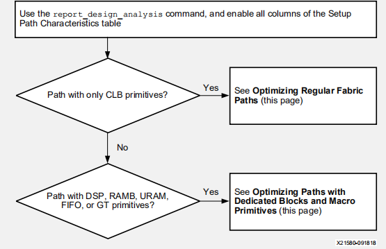
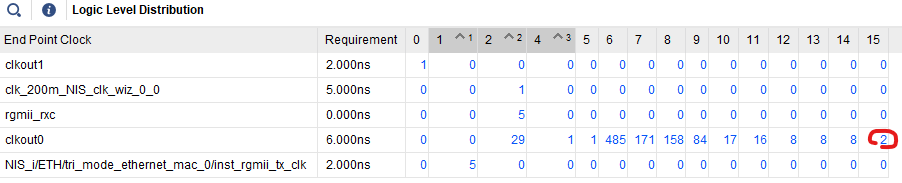

# 5减少逻辑延迟流程

在实现阶段，Vivado会把最关键的路径放在首位，这就是为什么在布局或布线之后可能出现逻辑级数低的路径时序反而未能收敛。因此，在综合或opt_design之后就要确认并优化那些逻辑级数较高的路径。这些路径的优化可有效降低工具在布局布线阶段为达到时序收敛而迭代的次数。同时，这类路径往往逻辑延迟较大。因此，降低这类路径的逻辑延迟对于时序收敛将大有裨益。



在这个流程中，我们需要关注两类路径：

- 寄存器 (FDx) 或移位寄存器 (SRLx) 之间的路径，中间穿过纯粹的CLB中的资源（FF，LUT，Carry，MUXF）；

- Block（DSP，BRAM，URAM，GT）之间的路径。

无论是哪种路径，首先要通过命令`report_design_analysis`进行定位，具体命令格式如下图所示（也可在Vivado菜单Reports -> Report Design Analysis下执行）。

```tcl
report_design_analysis -logic_level_distribution -logic_level_dist_paths 1000 -name logic_level
```

该命令可分析当前设计的逻辑级数分布情况，如下图所示，从而便于找到逻辑级数较高的路径。



## **优化常规结构路径**

### 输入较少的级联 LUT (LUT1-LUT4)

输入较少的级联 LUT (LUT1-LUT4) 可以相互合并来减少 LUT 使用量。如果路径中包含多个级联的小的LUT，检查一下这些LUT是否是因为设计层次、综合属性（KEEP，KEEP_HIERARCHY，DONT_TOUCH，MARK_DEBUG）等导致无法合并。

### 路径中存在单个的CARRY

如果路径中有单个的CARRY（不是级联的），检查一下这个CARRY是否限制了工具对LUT的优化，从而造成布局不是最优的。

如果是，可尝试在综合时使用FewerCarryChains策略或者在opt_design阶段对这个CARRY设置CARRY_REMAP属性（具体使用方法可查看UG904《Vivado Design Suite 用户指南：实现》）。

### 终点是SRL的路径

移位寄存器的 SRL* 延迟高于寄存器 FD* 延迟，且 SRL 布局的质量低于 FD 布局质量。

如果路径的终点是SRL，可尝试将SRL变为FF+SRL+FF或SRL+FF。这可在综合时通过使用SRL_STYLE综合属性实现，也可在opt_design阶段通过使用SRL_STAGES_TO_INPUT或SRL_STAGES_TO_OUTPUT实现。

### 终点是触发器控制端的路径

当逻辑路径终止于以 LUT 驱动的寄存器 (FD*) 的时钟使能 (CE) 引脚、同步建立 (S) 引脚或同步复位 (R) 引脚时，尤其是在路径最后一个网络的扇出大于 1 时，布线延迟高于寄存器数据引脚 (D)。

可尝试将这类逻辑搬移到触发器的数据端，这可在综合时通过设置EXTRACT_ENABLE或EXTRACT_RESET综合属性为no实现，或者在opt_design阶段通过设置CONTROL_SET_REMAP属性（具体使用方法可查看UG904）实现。

### 使用Retiming

此外，还可以在综合时对全局使用retiming（选中-retiming选项）或者采用模块化综合方式，对某个模块使用retiming。

## **优化专用块和宏原语最优化路径**

从专用块和宏原语（例如 DSP、块 AMB、URAM、FIFO 或 GT_CHANNEL）/到/在它们之间的逻辑路径布局难度更大，有更高的单元和布线延迟。因此，围绕宏原语添加额外的流水线或减少宏原语路径上的逻辑层次，对提升总体设计性能相当关键。

### 对于Block到Block的路径

对于Block到Block的路径，最好将其优化为Block + FF + Block。这里的FF可以是Block内部自带的触发器（如果有的话），也可以是Slice中的触发器。

如果数据由Block RAM输出，可采用如下命令观察使能Block RAM自带的寄存器之后是否对时序有所改善。这里要注意，如下命令用于评估，因为已造成设计功能改变，所有不要在此基础上生成bit文件。

```tcl
set_property –dict {DOA_REG 1 DOB_REG 1} [get_cells xx/ramb18_inst]
# 等效于
set_property DOA_REG 1 [get_cells xx/ramb18_inst]
set_property DOB_REG 1 [get_cells xx/ramb18_inst]
```

