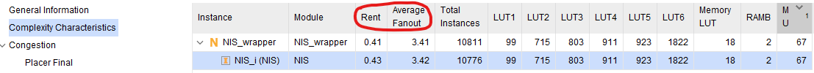
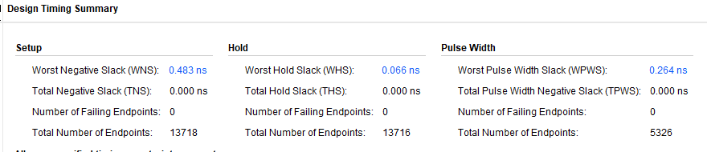

# 6降低信号网络延迟流程 1

当设计出现布线拥塞时，通常会导致布线延迟增大，从而影响时序收敛。布线拥塞程度可通过如下两种方式获取：

- 布线阶段的log文件中会显示拥塞程度

- 对于place_design或route_design生成的dcp文件，可通过如下命令获取

```tcl
report_design_analysis –congestion -name xx
```

> 添加-name可以让报告生成在报告栏中

生成的拥塞报告如下图所示。要格外关注拥塞程度（Congestion Level）大于4的区域。


> 20.1里面报告好像只会给出congestion level > 5的结果

全局拥塞给设计性能造成如下影响：

- **4 级 (16x16)**：在 route_design 过程中的小 QoR 可变性
- **5 级 (32x32)：**欠佳布局和值得注意到 QoR 变化
- **6 级 (64x64)：**布局布线难度大，编译时间长。除非性能目标低下，时序QoR 严重劣化。
- **7 级 (128x128) 及以上：**无法布局或布线。

对于拥塞程度大于4的情形，可采用如下流程加以改善并降低布线延迟。在如下的案例中，可以看到布线延迟占到了总延迟的94%，据此，可断定布线延迟是导致时序违例的根本原因。从布线结果看，在拥塞区域出现了绕线。


下面给出关键时序路径的示例，其中网络布线围绕拥塞区域绕行，导致更大的信号网络延迟。在“Device”窗口中启用“Interconnect Congestion Level”指标。


## 处理方式

### 减少拥塞

- 当整体资源利用率达到70%～80%时（对于多die芯片，这个数值是指每个SLR的资源利用率），需要砍掉一些模块以降低资源利用率。尤其要**避免LUT和RAM/DSP/URAM利用率同时出现大于80%**的情形。如果BRAM/DSP/URAM这些Block利用率无法降低，那么要确保LUT利用率低于60%。

  ```tcl
   xilinx::designutils::report_failfast -by_slr
  ```

  布局后使用上述指令逐个地审核利用率。

- 执行place_design时，尝试将-directive设置为AltSpreadLogic-或SSI_Spread-或将Implementation的策略设置为Congestion_*，如下图所示。


- 通过如下命令分析设计复杂度，找到设计中出现拥塞的模块（**Rent值大于0.65或Average Fanout大于4**）。之后，对这些模块实施模块化综合，其中的综合策略设置为ALTERNATE_ROUTABILITY。

  ```tcl
  report_design_analysis -complexity -congestion -name xx
  ```

  

  对拥塞模块采用模块化综合技术：

  ```tcl
  set_property BLOCK_SYNTH.STRATEGY {ALTERNATE_ROUTABILITY} [get_cells <congestedHierCellName>]
  ```

- 降低拥塞区域MUXF*和LUT-Combining的使用率，具体方法有时可通过report_qor_suggestions获得。在拥塞叶节点单元上设置

  ```tcl
  set_property BLOCK_SYNTH.MUXF_MAPPING 0 [get_cells <CellName>]
  set_property BLOCK_SYNTH.LUT_COMBINING 0 [get_cells <CellName>]
  ```

- 在布线区域内非关键的高扇出网线上引入BUFG

  ```tcl
  set_property CLOCK_BUFFER_TYPE BUFG [get_nets <highFanoutNetName>]
  ```

- 从之前低拥塞的布线或布局结果中继承DSP/BRAM/URAM的布局

  ```tcl
  # 获取BRAM FIFO DSP
  set brams [get_cells -hierarchical -filter "PRIMITIVE_SUBGROUP == BRAM || PRIMITIVE_SUBGROUP == FIFO"]
  set dsps [get_cells -hierarchical -filter {REF_NAME == DSP48E2}]
  # 继承DSP
  set_property IS_LOC_FIXED TRUE $dsps
  write_xdc -exclude_timing dsp_loc.xdc -force
  set_property IS_LOC_FIXED FALSE $dsps
  # 继承BRAM
  set_property IS_LOC_FIXED TRUE $brams
  write_xdc -exclude_timing bram_loc.xdc -force
  set_property IS_LOC_FIXED FALSE $brams
  ```

### 优化高扇出网络

在Reports->report_high_fanout_nets中可以查看高扇出网络，或者调用下面指令	

```
report_high_fanout_nets -name high_fanout_nets_1
```




#### 综合：受限复制

在RTL层面，基于设计层次复制寄存器降低扇出

- 使用 KEEP 属性在 RTL 中复制寄存器
- 使用 pblock 约束在每个 SLR 中进行复制

注意事项：**避免将 MAX_FANOUT 用于全局控制信号**，如果需要，只在小模块中的个别信号使用 MAX_FANOUT

#### Opt Design：粗粒度复制

​	**基于大设计层级**

- 在高扇出网络上插入、合并与分割 BUFG（默认执行） 

- 在opt_design阶段通过添加选项降低扇出。

  ```tcl
  opt_design 	-merge_equivalent_drivers	#合并所有 LUT 和 Flop 等效驱动器
  opt_design	-hier_fanout_limit 512		#控制基于模块的复制
  opt_design	-control_set_merge			#合并 opt_design 中的低扇出控制信号
  ```

  或者在settings中设置

  

  

  效果如下：原先扇出最大的路径扇出减少，新增连接到BUFG的时钟路径

  

  

#### Place Design：中粒度复制

​		**基于早期布局和时序信息**

布局器中的物理综合 (PSIP)

- 在全局布局过程中根据资源可用性自动插入 BUFG

- 布局过程中使用‘-fanout_opt’复制高扇出网络
- 复制连接到 DSP/BRAM 的低/中扇出网络

优点：

- 不需要在 RTL/综合层面进行猜测
- 理想的控制集使用
- 布局已知，而且复制基于驱动器和负载布局
- 在布局器中较早解决时序关键的 HFN
- 减少布局后的物理优化


#### Phys Opt Design：精细粒度复制

​		**基于精确时序信息**

- 在phys_opt_design（布局之后）阶段通过-force_replication_on_nets对关键的高扇出网线通过复制寄存器降低扇出。

  ```tcl
  phys_opt_design -force_replication_on_nets <net>
  # 或者
  Phys_opt_design -directive AggresiveExplore <net>
  ```

  **适用于IP内的高扇出路径（无法修改源码时）**

- 如果不是关键时序，而且高扇出网络直接馈送 FF ，将扇出 >25 k 的网络推广到全局时钟

  ```tcl
  set_property CLOCK_BUFFER_TYPE BUFG [get_nets netName]
  ```

  

