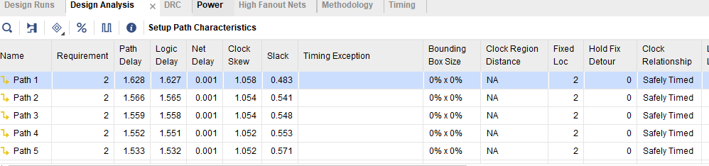
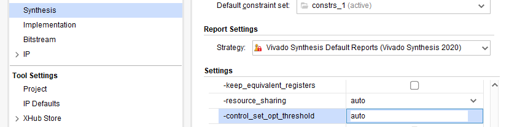

# 7降低信号网络延迟流程 2

布线延迟过大除了拥塞导致之外，还可能是其他因素。下图显示了降低布线延迟的另一流程（因其他因素导致布线延迟过大的处理流程）。


首先，通过report_design_analysis分析路径特征。有时还需要结合report_utilization和report_failfast两个命令。

## 第1步：分析路径的Hold Fix Detour是否大于0 ps？

Hold Fix Detour是工具为了**修复保持时间违例而产生的绕线**（该数值在design analysis报告中显示，如果没有显示，可在报告标题栏内点击右键，选择Hold Fix Detour）。如果该数值大于0，就有可能造成建立时间违例。**这时其实应关注的是该路径对应的保持时间报告，诊断为什么工具会通过绕线修复保持时间违例。**



要解决保持时间绕行对 Fmax 的影响，请参阅**“解决保持时间违规的方法”**

## 第2步：违例路径的各个逻辑单元是否存在位置约束？

通常，设计中不可避免地会有一些物理约束，如管脚分配。除此之外，还可能会有其他位置约束，如通过create_macro或Pblock创建的位置约束。如果设计发生改变，就需要关注这些位置约束是否仍然合理，**尤其是那些穿越多个Pblock的路径。**

## 第3步：违例路径是否穿越SLR？

如果目标芯片为多die芯片，那么在设计初期就要考虑到以下几个因素，以改善设计性能。

- 在设计的关键层次边界上以及跨die路径上插入流水寄存器，尤其是跨die路径，这些寄存器是必需的；
- 检查每个SLR的资源利用率是否合理，这可通过report_failfast –by_slr实现。-by_slr选项只能在place_design或route_design生成的dcp中使用，这也不难理解，毕竟在布局阶段工具才会把设计单元向相应的SLR内放置；
- 每个die的设计可以看作一个顶层，因此，要对每个顶层指定一个die，以确保相应的设计单元被正确放置在目标die内。这可通过属性USER_SLR_ASSIGNMENT实现（Vivado 2018.2开始支持）；
- 如果上述属性未能正确工作，可直接画Pblock进行约束；
- 在布局或布线之后如果仍有时序违例，可尝试使用phys_opt_design -slr_crossing_opt。

## 第4步：唯一控制集百分比是否大于7.5%？

控制集会影响布局和时序，唯一控制集个数可通过

```tcl
report_utilization
# 控制集具体内容
report_control_sets -verbose
```


如果控制集百分比超过7.5%，可通过如下方法降低控制集。

- 关注MAX_FANOUT属性：

  移除时钟使能、置位或复位信号的MAX_FANOUT属性。这是因为该属性会复制寄存器以降低扇出，但同时也增加了控制集；

- 在Synthesis阶段：

  - 利用全局综合选项提高–control_set_opt_threshold的数值，可使工具将更多同步控制信号搬移到数据路径，从而降低控制集；

  

  > 根据架构使用不同阀值 ： 7 系列使用的阈值为 4，UltraScale 和 UltraScale+ 使用的阈值为 2

  - 也可采用Block Level Synthesis技术，对指定模块设置该数值；

- 在opt_design阶段：

  -control_set_merge 

  -merge_equivalent_drivers

  这两个选项可帮助降低控制集。但这两个选项不能与-directive同时使用，所以如果是工程模式下，可将其放置在Hook文件中（Tcl.pre或Tcl.post）。非工程模式下，可在执行完-directive之后，再次执行这两个选项；

- 关注低扇出信号：

  - 对于低扇出的控制信号（同步使能、同步置位/同步复位），可对其连接的寄存器设置CONTROL_SET_REMAP属性，将控制信号搬移到数据路径上，从而降低控制集。

  - 或者在在 RTL 中使用 extract_enable 或 extract_reset

  
  - 在 XDC 文件中：

    ```tcl
    set_property extract_enable/reset "no" [get_cells U1/tmp_reg]
    ```

    

## 第5步：尝试其他实现策略

Vivado提供了多种实现策略。因此，尝试不同实现策略是达到时序收敛的一个手段。

- 尝试多个 place_design 指令（最多 10 个）和多次 phys_opt_design 迭代（Aggressive*、Alternate* 指令），这可通过设置不同的-directive实现；
- 尝试在 place_design/phys_opt_design 过程中过度约束最关键时钟（过约最大0.5ns），这可通过设置Clock Uncertainty实现。需要用到`set_clock_uncertainty`；
- 对关键时钟域下的路径设置更高的优先级，使工具对其优先布局布线，这可通过命令g`roup_path –weight`实现；
- 尝试使用增量布局布线，继承之前好的布局布线结果，并缩短编译时间。