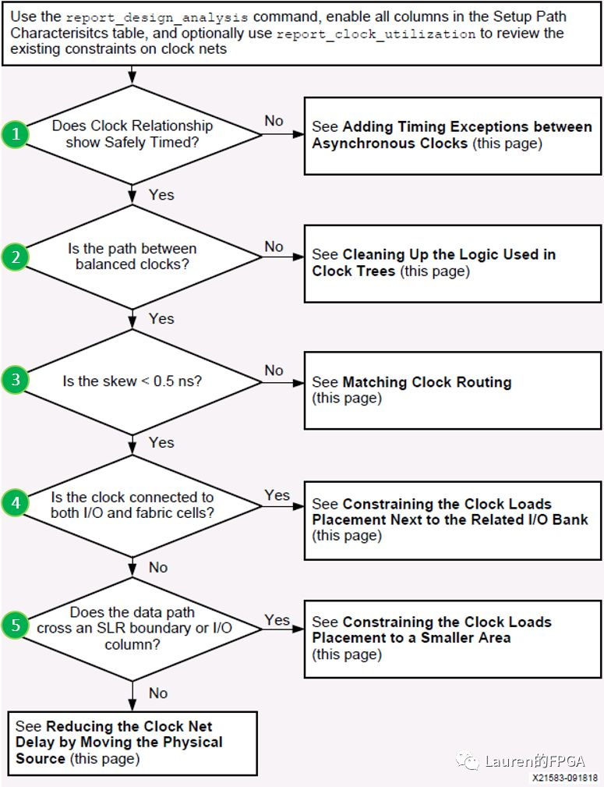
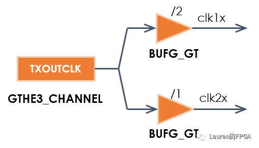
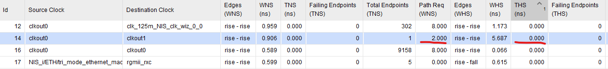
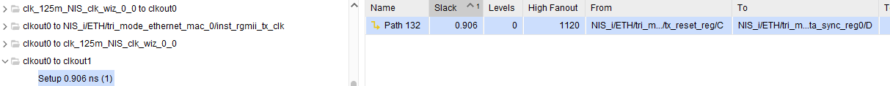
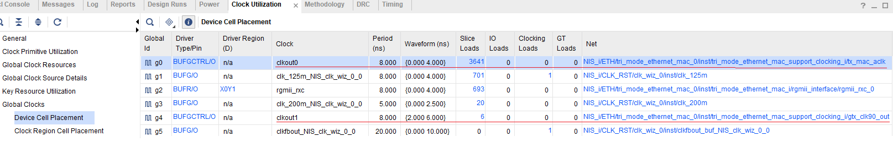
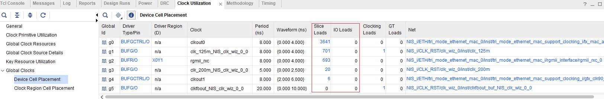

# 8改善时钟偏差流程

过大的Clock Skew也可能导致时序违例，尤其是其数值超过0.5 ns时。如下三个命令生成的报告中均可显示Clock Skew的具体数值。

```tcl
report_design_analysis
report_timing_summary
report_timing
```

降低Clock Skew可采用如下流程操作。



## 1异步跨时钟域路径是否被安全合理地约束

时钟关系有两种：同步时钟和异步时钟。如果发送时钟和接收时钟是同源的，例如来自于同一个MMCM，则认为二者是同步时钟，否则就按异步时钟处理。

处理异步时钟之间的时序路径，需要确保异步时钟域交汇电路 (report_cdc) 正确

对于异步跨时钟域路径，可采用如下三者之一进行约束：

```
set_clock_groups
set_false_path
set_max_delay -datapath_only
```

> 请参阅 (UG949)：《在异步时钟之间添加时序例外》

## 2发送时钟和接收时钟的时钟树结构是否平衡

时钟树结构其实就是时钟的拓扑结构。从发送时钟和接收时钟的角度看，平衡的时钟树结构是指二者“走过相同或等效的路径”。如下图所示，发送时钟和接收时钟来自级联的BUFG的不同位置上，这就是典型的不平衡时钟树。在设计中**要避免这种情形**。通过Tcl命令`report_methodology`可检查出设计中级联的BUFG。


同时，还要**利用好BUFG_GT和BUFGCE_DIV**，两者均可实现简单地分频**（7系列不支持）**。如下图所示，利用BUFG_GT实现二分频，从而节省了MMCM。



此外，**不能在时钟路径上存在组合逻辑**。在时序报告中，点击如下图标记的按钮，按下F4，在显示时序路径的同时也会显示该路径的时钟拓扑结构。


## 3检查Clock Skew是否小于0.5ns

`CLOCK_DELAY_GROUP`可有效改善**同步跨时钟域路径的Clock Skew**(例如同一个MMCM出来的不同时钟），因此，Xilinx建议对于关键的同步跨时钟域路径，可通过设置该属性降低Clock Skew，**使发送时钟和接收时钟具有相同的CLOCK_ROOT值**。`CLOCK_DELAY_GROUP`的具体使用方法如下图所示，其中**clk1_net和clk2_net是Clock Buffer的输出端连接的net**。但是，避免过多使用该属性，否则会适得其反。

```tcl
set_property CLOCK_DELAY_GROUP grp12 [get_nets {clk1_net,clk2_net}]
```

#### 如何使用

使用 report_clock_interaction 确定关键 CDC 路径**（预布线）**，找出具有最严格设置要求和最高 THS 违规的 4 个时钟。这里我们假设clkout0到clkout1信号



也可以由report_timing_summary中的inter-clock paths找到需要改善的同步时钟，



通过report_clock_utilization可以找到时钟对应输出端连接的net



```tcl
# 得到clkout0输出端连接的net
set clk0 [get_nets NIS_i/ETH/tri_mode_ethernet_mac_0/inst/tri_mode_ethernet_mac_support_clocking_i/tx_mac_aclk]
# 得到clkout1输出端连接的net
set clk1 [get_nets NIS_i/ETH/tri_mode_ethernet_mac_0/inst/tri_mode_ethernet_mac_support_clocking_i/gtx_clk90_out]
# 设置CLOCK_DELAY_GROUP
set_property CLOCK_DELAY_GROUP clk0_clk1_grp1 [get_nets [list $clk0 $clk1]]
```

## 4时钟是否同时驱动I/O和Slice中的逻辑资源

如果时钟**同时驱动I/O和Slice中的逻辑资源**，且负载小于2000时，可通过CLOCK_LOW_FANOUT属性对相应的时钟net进行设置，最终可使工具将该时钟驱动的所有负载放置在同一个时钟域内。通过命令`report_clock_utilization`生成的报告可查看每个时钟的负载，如下图所示：



CLOCK_LOW_FANOUT的具体使用方法如下图所示

```tcl
# 假设clk200m符合条件
set_property CLOCK_LOW_FANOUT TRUE [get_nets NIS_i/CLK_RST/clk_wiz_0/inst/clk_200m]
```

## 5检查数据路径是否穿越SLR或I/O Column

如果时钟负载较小且穿越SLR或I/O Column时，可通过Pblock实施位置约束，将负载限定在一定区域内，例如在一个SLR内，以避免穿越一些特殊列，例如I/O Column。

相反地，如果数据路径并未穿越SLR或I/O Column，可尝试对相应的MMCM或PLL做位置约束，使其位于这些负载的中央。

> 参阅 **(UG949)**：《降低 **UltraScale** **和** **UltraScale+** **器件的偏差》。**