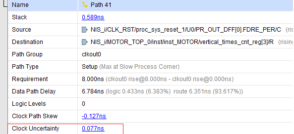
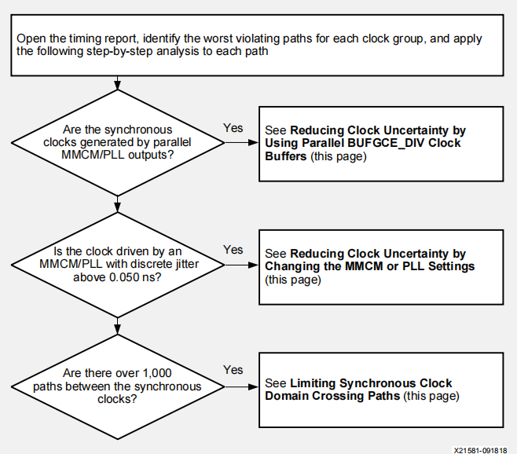
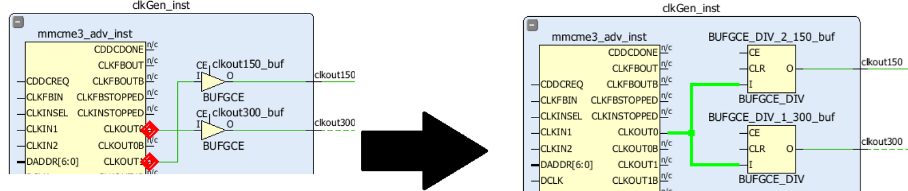
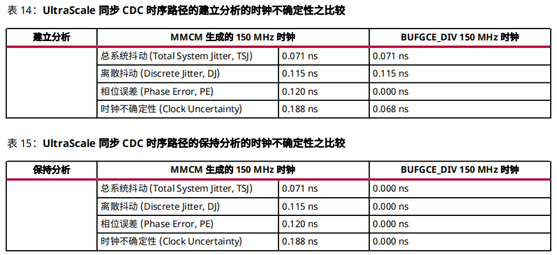
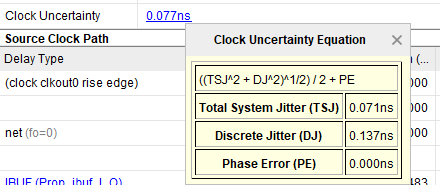
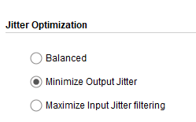
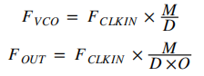
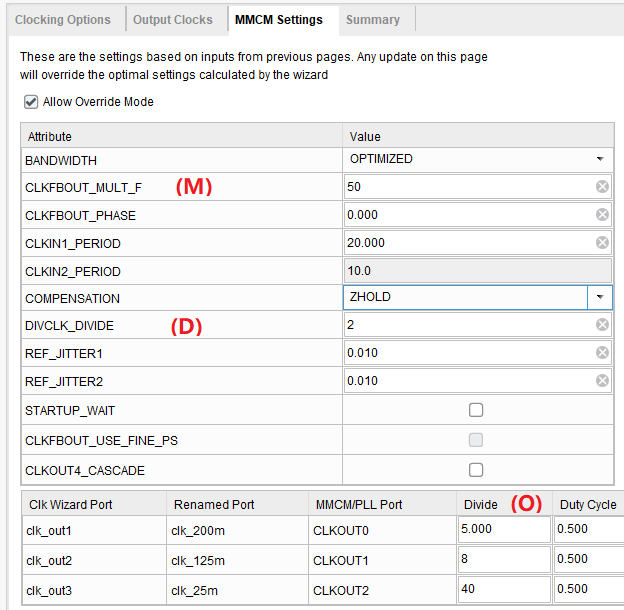
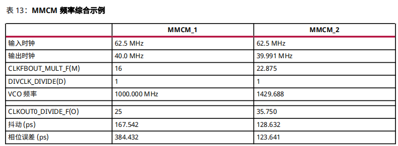

# 9改善时钟不确定性流程

时钟不确定性指：

- 抖动：输入抖动（input jitter）、系统抖动（system jitter）、离散抖动（discrete jitter）
- 相位错误（phase error）
- 用户加入的不确定的量（user-added uncertainty）

**当时序违例路径的Clock Uncertainty超过0.1 ns时，应引起关注。**

**UG1292** 提供的解决流程如下

## 1同步时钟是否由两个并行的MMCM或PLL生成

在UltraScale™ 和 UltraScale+™系列芯片中，对于由相同 MMCM 或 PLL 生成并受多个时钟输出驱动的周期比为 2、4 或 8 的同步时钟，仅使用 1 个 MMCM 或 PLL 输出并将其连接到并行 BUFGCE_DIV 时钟缓存**（7系列不支持）**。

在使用时钟向导生成使用并行 BUFGCE_DIV 缓存的时钟拓扑后，同时设置时钟上的 `CLOCK_DELAY_GROUP` 属性。这种时钟拓扑能消除 MMCM 或 PLL 相位偏差，大多数情况能实现 0.120 ns 的时钟不确定性。

## 2生成时钟其Discrete Jitter>0.05 ns?

Discrete Jitter是由MMCM/PLL引入的，其具体数值可通过点击时序报告的Clock Uncertainty数值查看

通常，VCO的频率越高，引入的Discrete Jitter会越小。**推荐在配置时选择minimize output jitter可提高VCO频率。**

以下公式显示了 VCO 频率、M （乘法器）、D（除法器）与 O（输出除法器）设置与输入和输出时钟频率之间的关系。

可通过手工调整VCO的频率（在Clocking Wizard中修改M和D两个参数）达到降低Discrete Jitter的目的。

此外，对所期望的输出时钟频率稍作更改可以进一步提高 VCO 频率（如40 MHz -> 39.991 MHz）。

此外，如果可以的话，用PLL替代MMCM。相比于MMCM，PLL引入的jitter会小一些。

## 3同步跨时钟域路径是否超过1000条

过多的同步跨时钟域路径会对时序收敛带来一定的挑战，尤其是时钟频率比较高时，例如频率为500 MHz。。要想确定两个时钟间的路径数量，使用 `report_timing_summary`（时钟间路径部分）或 `report_clock_interaction`。

此时要检查这些路径。

（1）在受时钟使能控制的路径上添加**多周期路径约束**

（2）在Latency允许的情况下，通过FIFO或XPM_CDC处理跨时钟域路径

> 参阅《UltraScale 架构库指南》(UG974)。