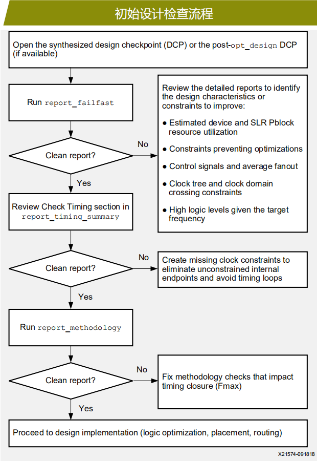
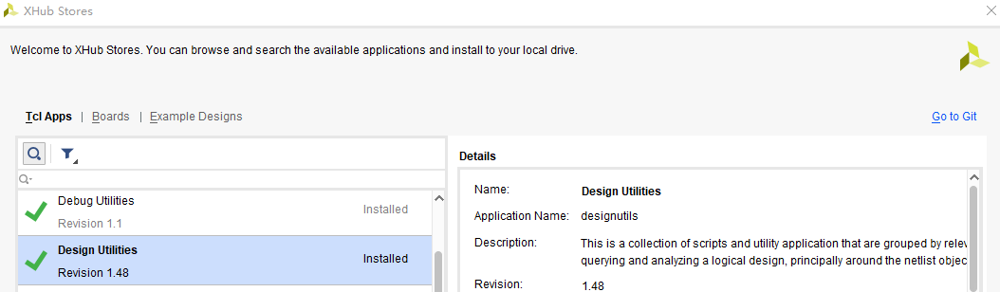
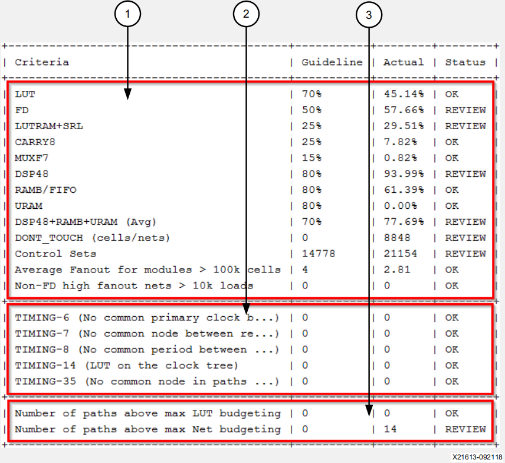
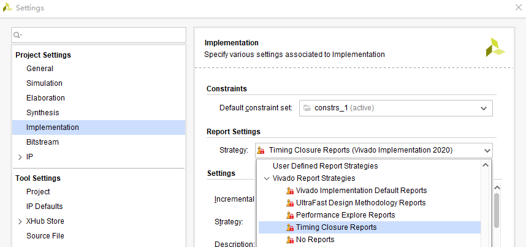
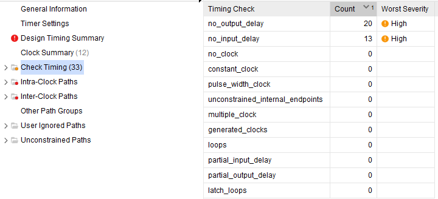
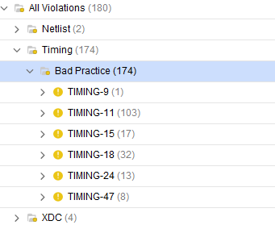

# 0前言

Xilinx关于时序收敛的文档常用有三个：

| UG949      | UltraFast 设计方法指南（适用于 Vivado Design Suite） |
| ---------- | ---------------------------------------------------- |
| **UG1292** | **UltraFast 设计方法时序收敛快捷参考指南**           |
| **UG906**  | **Vivado Design Suite 用户指南 设计分析与收敛技巧**  |

**UG1292** **可以作为时序收敛的快速参考手册，更系统直观的介绍时序收敛的方法，而**UG949**为更具体的手册用于查找具体信息。

目前三个文档在Xilinx官网均有中文版：https://china.xilinx.com/search/site-keyword-search.html#q=ug949

**UG1292**和**UG949**的基本理念：尽可能地把所有问题放在设计初期解决。**UG1292**手册内容只有10页，几乎涵盖所有时序违例的解决方法，提供了以下简化的分步骤快速收敛时序流程：

- **初始设计检查：**在实现设计前审核资源利用率、逻辑层次和时序约束。

- **时序基线：**在每个实现步骤后检查并解决时序违规，从而帮助布线后收敛时序。

- **时序违规解决：**识别建立时间违规或保持时间违规的根源，并解决时序违规。

手册内容如下：

| 页码 | 中文名称               |
| ---- | ---------------------- |
| 1    | 初始设计检查流程       |
| 2    | 时序基线流程           |
| 3    | 分析建立时间违规流程   |
| 4    | 解决保持时间违规流程   |
| 5    | 减少逻辑延迟流程       |
| 6    | 降低信号网络延迟流程 1 |
| 7    | 降低信号网络延迟流程 2 |
| 8    | 改善时钟偏差流程       |
| 9    | 改善时钟不确定性流程   |
| 10   | FAILFAST 报告概览      |

在设计后期，往往会面临牵一发而动全身的被动局面。即使一个小的改动都有可能花费很多的时间和精力甚至造成返工。就时序收敛而言，在定义设计规格时就要有所考虑；写代码时要从代码风格角度考虑对时序的影响；综合之后就要查看时序报告，检查设计潜在问题。

通过阅读文档，了解时序违例路径：

- *逻辑延迟占总延迟多大百分比时需要优化*
- *布线延迟占总延迟多大百分比时需要优化*
- *时钟歪斜和时钟不确定性超过哪个界限时需要优化*
- *WHS在哪个阶段超过哪个界限时需要优化*

在设计综合之后，就开始按照手册第一页流程对设计进行初始检查。当检查都过关之后，才可以进行下一页的操作。在设计后期，根据上述数值判定造成时序违例的主要因素，然后回到相应页码查看解决方案。

# 1初始设计检查流程

**初始设计检查对象是synthesis或者opt_design阶段生成的dcp（design checkpoint）**。在Vivado设计中，在implementation过程中会做很多优化：

| opt_design          | 逻辑优化     |
| ------------------- | ------------ |
| **place_design**    | **布局**     |
| **phys_opt_design** | **物理优化** |
| **route_design**    | **布线**     |

这些优化可能会导致关键路径被掩盖，例如，有时发现设计中逻辑级数（Logic Level）较高的路径时序收敛了，反倒是逻辑级数较低甚至为0的路径出现时序违例。因此，采取按部就班的策略，检查每一步的结果，及时且尽早发现设计中的问题是很有必要的。

初始设计检查流程需要检查三个报告：FAILFAST报告、时序报告和UFDM（UltraFast Design Methodology）报告，具体流程如下：



## FAILFAST报告

生成FAILFAST报告需要在Vivado中Tools->XHub Stores检查Design utilities是否安装



执行如下tcl命令即可得到FAILFAST报告

```tcl
xilinx::designutils::report_failfast -detailed_report impl -file failfast.rpt
```

具体的报告分为三个部分：

1. **设计特性**：默认利用率指南基于 SSI 技术器件，对非 SSI 技术器件可以放松。有一个或多个 REVIEW 检查的设计可行但难以实现。

   > 小规模集成电路（SSI）、中规模集成电路（MSI）、大规模集成电路（LSI）、超大规模集成电路（VLSI）

2. **时钟检查**：这些检查非常重要，必须解决。

3. **LUT** **和网络预算**：使用保守方法更可靠地预测在器件利用率高的情况下布局后哪些逻辑路径最可能无法满足时序要求。



FAILFAST报告中对于资源利用给出了参考值，对于LUT，利用率应控制在70%以内；触发器（FD）应控制在50%以内；BlockRAM和DSP48可以达到80%。

**在这个报告中尤其要关注Status为Review的条目**，这是会给时序收敛带来负面影响的，需要优化。对于设计中存在Pblock情形，report_failfast提供了-pblock选项，对于SSI器件，report_failfast提供了-slr和-by_slr（需要在place_design阶段生成的dcp下使用）选项。这样，可针对某个pblock或某个SLR进行分析。

```tcl
report_utilization –pblocks <pblockName>
report_failfast –pblock <pblockName>
report_failfast [–slr SLRn | -by_slr]
```

## 时序报告

综合实现的步骤：

`synth_design -> opt_design -> place-design -> phys_opt_design -> route_design`

synthesis之后给出的时序报告都是估计值，因此**synthesis的时序报告可以不考虑Hold Time，只考虑Setup Time**；即便此时Hold Time违例，我们也不需要去理会。

在Place Design之后再去看Hold Time，如果此时Hold Time的违例比较小（比如-0.05 ns），还是不需要理会的，因为工具在布线时会修复Hold，但如果Slack太大了，无法修复了，就会牺牲setup来弥补hold。

我们可以让工具在每一步执行后都会有时序报告，只需要把`Tools->Settings->implementation->Report Settings`的策略选择为`Timing Closure Reports`



通过执行report_timing_summary可以生成时序报告，除了查看时序违例路径之外，该报告还可显示时序约束是否存在潜在问题。如下图所示，Check Timing下包含12个条目，这个阶段需要格外关注是否有未约束的时序路径，是否有Timing loop，同时还要关注时钟约束是否合理。



## UFDM报告

report_methodology可以生成UFDM报告。该命令不仅可以检查RTL代码存在的问题，例如Block RAM没有使用内部Embedded Registers，DSP48用做乘法器时没有使能MREG等，还可以检查时序约束存在的问题。如图所示，要尤其关注其中的Bad Practice。

